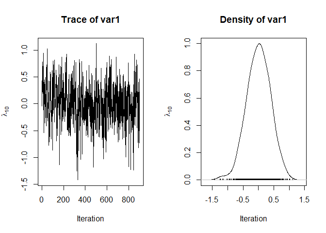
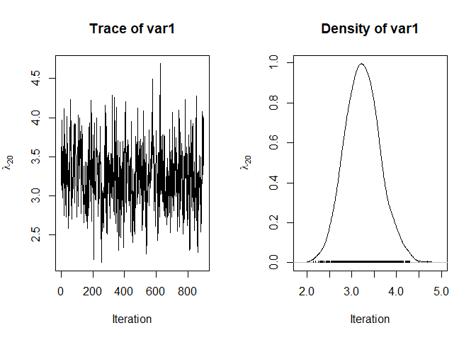
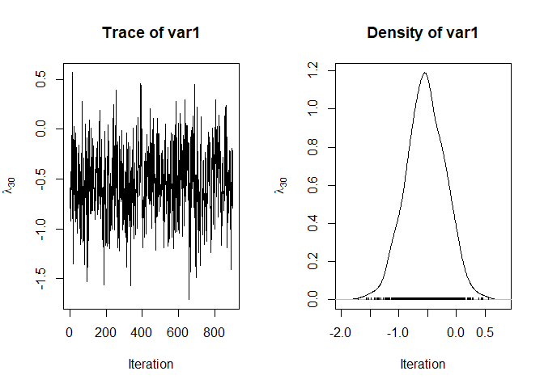
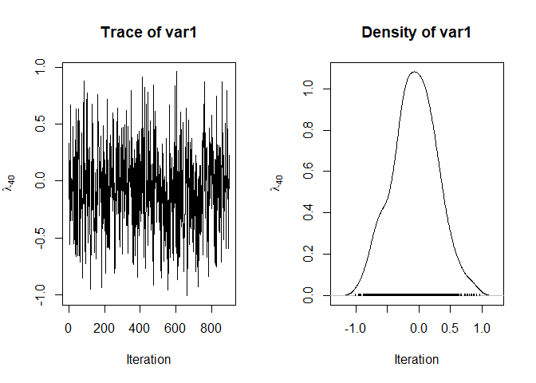
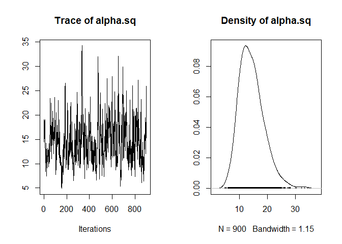
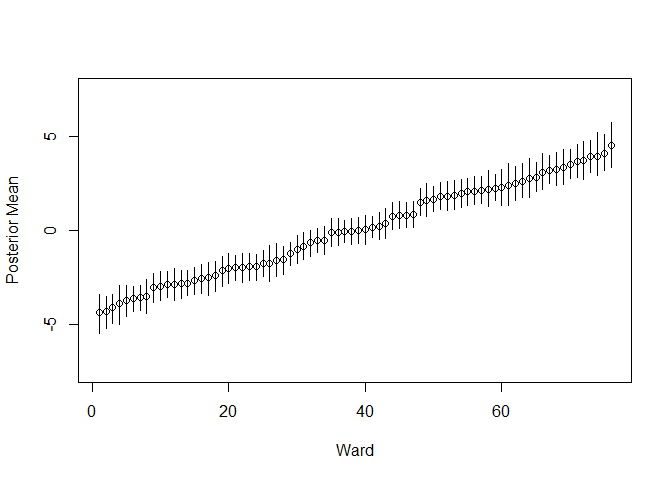

<!-- QUALITY_BADGE_START -->
[](RSFC_REPORT.md)
<!-- QUALITY_BADGE_END -->


<!-- README.md is generated from README.Rmd. Please edit that file -->

# speedyBBT 

<!-- badges: start -->

[](https://github.com/rowlandseymour/speedyBBT/actions/workflows/R-CMD-check.yaml)
[](https://app.codecov.io/gh/rowlandseymour/speedyBBT)
<!-- badges: end -->

## Overview

`speedyBBT` is an R package for fitting Bradley-Terry models to pairwise
comparison data using fast, fully Bayesian MCMC. Given a set of pairwise
judgements – which of two wards has the higher rate of forced marriage,
which of two tennis players won a match, which of two neighbourhoods
looks more deprived – `speedyBBT` estimates a quality parameter for
every item being compared, along with full posterior uncertainty.

Inference is carried out using a Pólya-Gamma data augmentation scheme,
which makes sampling fast even for large numbers of items and
comparisons. The package supports:

- the standard Bradley-Terry model (`speedyBBTm()`), optimised for speed
  when there are no ties or comparison-specific effects;
- ties, comparison-specific effects (e.g. home advantage), and
  item-level covariates via a formula interface (`BBTm()`);
- multivariate normal prior distributions on the item quality
  parameters, so that structure between items (e.g. spatial adjacency)
  can be encoded directly into the prior;
- optional hyperparameter inference on the prior scale.

The package can be used with data collected using the [Comparative
Judgement
Interface](https://github.com/HiddenHarmsHub/comparative-judgement-interface).

## Getting started

If you’re new to `speedyBBT`, start with the [Getting started with
speedyBBT](vignettes/speedyBBT.Rmd) vignette, which walks through
fitting a model to real comparative-judgement data end to end.

## Resources

- [Report a bug or request a
  feature](https://github.com/rowlandseymour/speedyBBT/issues)
- [Browse the source](https://github.com/rowlandseymour/speedyBBT)

Questions and contributions are welcome; open an issue to start a
discussion.

## Installation

Install the released version from CRAN:

``` r
install.packages("speedyBBT")
# for development version
# devtools::install_github("rowlandseymour/speedyBBT", dependencies = TRUE) 
```

## Usage

The code chunks below show how to use the package to fit the
Bradley–Terry model to a data set relating to forced marriage. Judges
were shown pairs of wards and asked which had a higher rate of forced
marriage. We can use the `speedyBBTm` function to draw samples for the
full conditional distributions for the ward quality parameters. We place
a multivariate normal prior distribution on the ward quality parameters.
The covariance matrix of this prior distribution is constructed using a
network representation of the wards in Nottinghamshire.

``` r
#View Data
data("forcedMarriage", package = "speedyBBT")
head(forcedMarriage$comparisons)
#>   user            time win lost
#> 1    1 16:08:26.316839  67   31
#> 2    1 16:08:47.888894  19    9
#> 3    1 16:09:14.093517  18   74
#> 4    1 16:09:23.666987  56   68
#> 5    1 16:09:42.930976  50   66
#> 6    1 16:09:51.129570  53   15


#Construct covariance matrix
expA  <- expm::expm(forcedMarriage$adjacencyMatrix)
prior.var <- diag(diag(expA)^-0.5) %*% expA %*% diag(diag(expA)^-0.5)
    
#Fit model
library(speedyBBT)
forcedMarriageModel <- speedyBBTm(outcome = rep(1, length(forcedMarriage$comparisons$win)),
                                  player1 = forcedMarriage$comparisons$win, 
                                  player2 = forcedMarriage$comparisons$lost, 
                                  player.prior.var = prior.var)
lambda_draws  <- parameter(forcedMarriageModel, "lambda") 
lambda_centered <- lambda_draws - rowMeans(lambda_draws)

#View Trace Plots
plot(lambda_centered[, 10], type = 'l',
     xlab = "Iteration", ylab = expression(lambda[10]))
```



``` r
plot(lambda_centered[, 20], type = 'l', 
     xlab = "Iteration", ylab = expression(lambda[20]))
```



``` r
plot(lambda_centered[, 30], type = 'l', 
     xlab = "Iteration", ylab = expression(lambda[30]))
```



``` r
plot(lambda_centered[, 40], type = 'l', 
     xlab = "Iteration", ylab = expression(lambda[40]))
```



``` r

plot(parameter(forcedMarriageModel, "alpha.sq"), type = 'l')
```



``` r

#View Results
forcedMarriageModelMeans <- colMeans(lambda_draws)
forcedMarriageModelLowerCI <- apply(lambda_draws, 2, quantile, 0.025)
forcedMarriageModelUpperCI <- apply(lambda_draws, 2, quantile, 0.975)
forcedMarriageResults <- data.frame("ward" = forcedMarriage$wards$NAME,
                                    "mean" = forcedMarriageModelMeans,
                                    "lowerCI" = forcedMarriageModelLowerCI, 
                                    "upperCI" = forcedMarriageModelUpperCI)
forcedMarriageResults <- forcedMarriageResults[order(forcedMarriageResults$mean), ]

plot(forcedMarriageResults$mean, xlab = "Ward", ylab = "Posterior Mean", ylim = c(-7.5, 7.5))
segments(x0 = 1:nrow(forcedMarriageResults), y0 = forcedMarriageResults$lowerCI, 
         y1 = forcedMarriageResults$upperCI)
```



## References

- [J. Jiang, J. Marsh, and R. G. Seymour. 2026. A reduced basis
  decomposition approach to efficient data collection in pairwise
  comparison studies. Computational
  Statistics.](https://doi.org/10.1007/s00180-026-01737-3)
- [R. G. Seymour, A. Nyarko-Agyei, H. R. McCabe,K. Severn,D.Sirl, T.
  Kypraios, A. Taylor. 2025. Comparative Judgement Modeling to Map
  Forced Marriage at Local Levels. Annals of Applied
  Statistics](doi.org/10.1214/24-AOAS1966).
- [R. G. Seymour, D. Sirl, S. Preston, and J. Goulding. 2023.
  Multi-Level Spatial Comparative Judgement Models to Map Deprivation.
  Proceedings of the Joint Statistical Meeting
  2023.](https://zenodo.org/records/8314257)
- [R. G. Seymour, D. Sirl, S. Preston,\|. L. Dryden, B. Perrat, M. J. A.
  Ellis, and J. Goulding. 2022. The Bayesian Spatial Bradley-Terry
  model: Urban deprivation modelling in Tanzania. Journal of the Royal
  Statistical Society: C. 71 (2).](https://doi.org/10.1111/rssc.12532)

## Acknowledgements

This work is supported by a UKRI Future Leaders Fellowship
\[MR/X034992/1\].

Previously, it has been supported by the Engineering and Physical
Sciences Research Council \[grant numbers EP/T003928/1, EP/R513283/1\],
the Economic and Social Sciences Research Council \[ES/V015370/1\] and
the Research England Policy Support Fund.

The Dar es Salaam comparative judgement dataset was collected by
Madeleine Ellis, James Goulding, Bertrand Perrat, Gavin Smith and Gregor
Engelmann. We gratefully acknowledge the Rights Lab at the University of
Nottingham for supporting funding for the comprehensive ground truth
survey. We also acknowledge Humanitarian Street Mapping Team (HOT) for
providing a team of experts in data collection to facilitate the
surveys. This fieldwork was also supported by the EPSRC Horizon Centre
for Doctoral Training - My Life in Data (EP/L015463/1) and by EPSRC
grant Neodemographics (EP/L021080/1).

The data in Nottinghamshire was collected with support from the
Nottinghamshire Slavery Multi Agency Risk Assessment Conference. Data in
South Yorkshire was collected with support from South Yorkshire Police.
Data in Wokingham was collected with support from Wokingham Council.
Data in Oxfordshire was collected with support from Oxford Against
Cutting. Data in West Yorkshire was collected with support from West
Yorkshire Police and Karma Nirvana.
