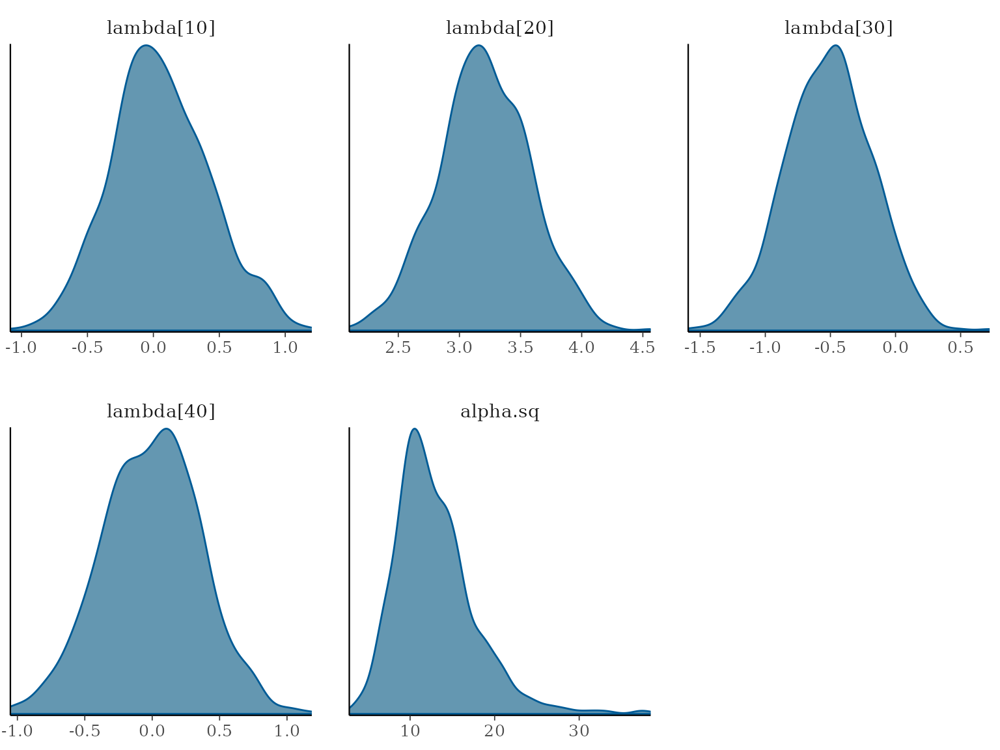

# Getting started with speedyBBT

``` r

library(speedyBBT)
library(coda)
```

`speedyBBT` is a package for Bayesian Bradley-Terry modelling. It
provides functions for fitting the Bradley-Terry model using Markov
Chain Monte Carlo (MCMC) methods, allowing for inference on player
abilities and hyperparameters. It uses latent P'olya-Gamma variables to
facilitate efficient sampling.

To fit a Bradley-Terry model using `speedyBBT`, you can first install
the package from CRAN or install the development version from GitHub.

``` r

# Install from CRAN
# install.packages("speedyBBT")
# Install the development version from GitHub
# remotes::install_github("rowlandseymour/speedyBBT")
```

You can learn more about the package functions and how to use them from
the documentation which can be accessed using `?function_name` in R. For
example, to learn about the `speedyBBTm` function, you can run:

``` r

?speedyBBTm
```

The package includes some example datasets that you can use to practice
fitting models. These datasets are automatically loaded when you install
the package. To view the `forcedMarriage` dataset, you can run:

``` r

data("forcedMarriage")
```

This dataset was collected from 12 judges in Nottinghamshire who were
asked to judge which of a pair of 76 wards had a higher risk of forced
marriage. The dataset contains the results of the 1,846 pairwise
comparisons made by the judges. An adjacency matrix is constructed based
on proximity, assuming that geographically close wards are more highly
correlated. This serves as a covariance matrix for the multivariate
normal prior distribution of the item qualities. In this case, the
“items” are wards in Nottinghamshire and their “quality” is the risk of
forced marriage in that ward.

The `speedyBBTm` function can be used to fit a Bradley-Terry model to
the data. To start with, you need to construct the prior distribution
for the item qualities. This needs to be a Normal distribution. For this
example, you can use the adjacency matrix provided with the package data
and then use it to create a covariance matrix for the prior distribution
of the item qualities. For your own data set, you will want to create an
adjacency matrix with values that denote the similarity of different
items to one another. For this example, the adjacency matrix ranks wards
that are closer to one another as more similar. You can specify the
outcome variable, the items involved in each comparison, and any prior
information you have about the items’ rating. In this example, the items
are the individual wards. The function will return an MCMC object
containing samples from the posterior distribution of the item
qualities.

``` r

# Construct covariance matrix
expA <- expm::expm(forcedMarriage$adjacencyMatrix)
prior.var <- diag(diag(expA)^-0.5) %*% expA %*% diag(diag(expA)^-0.5)
```

Next, you can fit the model using the
[`speedyBBTm()`](reference/speedyBBTm.md) function. You will need to
specify the outcome variable, the items involved in each comparison, and
the prior covariance matrix for the item qualities. You can also specify
the number of MCMC iterations to run. This example uses the default
values for the hyperparameters of the prior distribution, but you can
also specify your own values if you have prior knowledge about the
items’ rating using the `hyperparameter` argument. To match the plots in
this vignette, you will need to use the same argument to `set.seed` as
the one provided here.

``` r

# Fit model
set.seed(432)
forcedMarriageModel <- speedyBBTm(
  outcome = rep(1, length(forcedMarriage$comparisons$win)),
  player1 = forcedMarriage$comparisons$win,
  player2 = forcedMarriage$comparisons$lost,
  player.prior.var = prior.var,
  n.iter = 10000,
  burn.in = 100
)
#>   |                                                                              |                                                                      |   0%
```

To view some preliminary information about the results, you can
calculate the means of the item quality parameters from the MCMC samples
and summarise them. This will give you an idea of the estimated
qualities of the items based on the comparisons in the dataset.

``` r

forcedMarriageModelMeans <- colMeans(forcedMarriageModel[, grep("lambda", varnames(forcedMarriageModel))])
forcedMarriageModelMeans
#>   lambda[1]   lambda[2]   lambda[3]   lambda[4]   lambda[5]   lambda[6] 
#>  4.52915393  1.89396353  2.66660768  2.17305719  3.90360448  3.64249117 
#>   lambda[7]   lambda[8]   lambda[9]  lambda[10]  lambda[11]  lambda[12] 
#>  3.36582025  4.09714837 -0.06397722  0.03890927  1.68941936  1.54784848 
#>  lambda[13]  lambda[14]  lambda[15]  lambda[16]  lambda[17]  lambda[18] 
#>  0.81951014  0.18418959  1.99405825 -0.03220508 -0.65259548  2.14829535 
#>  lambda[19]  lambda[20]  lambda[21]  lambda[22]  lambda[23]  lambda[24] 
#>  2.86342118  3.21667237  1.61565479  2.27106008  0.02456295  2.05816610 
#>  lambda[25]  lambda[26]  lambda[27]  lambda[28]  lambda[29]  lambda[30] 
#>  3.97978119  2.12469063  3.23364626 -0.05615048 -1.24454682 -0.53341111 
#>  lambda[31]  lambda[32]  lambda[33]  lambda[34]  lambda[35]  lambda[36] 
#> -0.84609241  3.72850402  0.78135481  0.41609900  0.80915730  0.87679933 
#>  lambda[37]  lambda[38]  lambda[39]  lambda[40]  lambda[41]  lambda[42] 
#>  2.50501412 -0.52006768  0.23697345 -0.04173245  2.81085394  2.43522496 
#>  lambda[43]  lambda[44]  lambda[45]  lambda[46]  lambda[47]  lambda[48] 
#>  2.23940232  3.54003026  3.14390067 -2.54853194 -1.96840468 -3.06091214 
#>  lambda[49]  lambda[50]  lambda[51]  lambda[52]  lambda[53]  lambda[54] 
#> -2.14535591  1.84323125 -1.63680253 -1.82140425 -1.57653231 -2.03511914 
#>  lambda[55]  lambda[56]  lambda[57]  lambda[58]  lambda[59]  lambda[60] 
#>  1.85534836 -2.92146260 -2.02843989 -1.75648117 -3.64368587 -3.48899177 
#>  lambda[61]  lambda[62]  lambda[63]  lambda[64]  lambda[65]  lambda[66] 
#> -1.93710149 -2.59451640 -2.93465911 -2.84709656 -3.67559024 -3.90459081 
#>  lambda[67]  lambda[68]  lambda[69]  lambda[70]  lambda[71]  lambda[72] 
#> -2.68481044 -4.14128316 -1.97138912 -4.50833798 -3.00168777 -4.33546984 
#>  lambda[73]  lambda[74]  lambda[75]  lambda[76] 
#> -2.84056514 -2.45687558 -3.81649723 -1.03025260
summary(forcedMarriageModel)
#> 
#> Iterations = 1:9900
#> Thinning interval = 1 
#> Number of chains = 1 
#> Sample size per chain = 9900 
#> 
#> 1. Empirical mean and standard deviation for each variable,
#>    plus standard error of the mean:
#> 
#>                Mean     SD Naive SE Time-series SE
#> lambda[1]   4.52915 0.5877 0.005906       0.013078
#> lambda[2]   1.89396 0.4181 0.004202       0.007919
#> lambda[3]   2.66661 0.4762 0.004786       0.007597
#> lambda[4]   2.17306 0.4737 0.004761       0.007800
#> lambda[5]   3.90360 0.4530 0.004552       0.009181
#> lambda[6]   3.64249 0.4417 0.004439       0.009255
#> lambda[7]   3.36582 0.4487 0.004510       0.008570
#> lambda[8]   4.09715 0.4615 0.004638       0.009344
#> lambda[9]  -0.06398 0.3717 0.003736       0.005597
#> lambda[10]  0.03891 0.3722 0.003741       0.006018
#> lambda[11]  1.68942 0.3770 0.003789       0.005567
#> lambda[12]  1.54785 0.3771 0.003790       0.006124
#> lambda[13]  0.81951 0.3580 0.003598       0.006378
#> lambda[14]  0.18419 0.2857 0.002872       0.004393
#> lambda[15]  1.99406 0.4103 0.004124       0.008018
#> lambda[16] -0.03221 0.3127 0.003143       0.004550
#> lambda[17] -0.65260 0.3740 0.003759       0.005398
#> lambda[18]  2.14830 0.3788 0.003807       0.005761
#> lambda[19]  2.86342 0.4021 0.004041       0.008404
#> lambda[20]  3.21667 0.3702 0.003721       0.007539
#> lambda[21]  1.61565 0.4401 0.004424       0.007482
#> lambda[22]  2.27106 0.3688 0.003707       0.007863
#> lambda[23]  0.02456 0.3685 0.003704       0.005502
#> lambda[24]  2.05817 0.3671 0.003689       0.005663
#> lambda[25]  3.97978 0.5883 0.005913       0.012093
#> lambda[26]  2.12469 0.3708 0.003726       0.006370
#> lambda[27]  3.23365 0.4712 0.004736       0.008595
#> lambda[28] -0.05615 0.3731 0.003750       0.006434
#> lambda[29] -1.24455 0.3413 0.003430       0.005607
#> lambda[30] -0.53341 0.3291 0.003307       0.005004
#> lambda[31] -0.84609 0.3733 0.003752       0.005656
#> lambda[32]  3.72850 0.5480 0.005508       0.011749
#> lambda[33]  0.78135 0.3494 0.003512       0.005187
#> lambda[34]  0.41610 0.4163 0.004184       0.006671
#> lambda[35]  0.80916 0.3898 0.003918       0.006337
#> lambda[36]  0.87680 0.3412 0.003430       0.005112
#> lambda[37]  2.50501 0.4534 0.004557       0.007692
#> lambda[38] -0.52007 0.3971 0.003991       0.006500
#> lambda[39]  0.23697 0.3713 0.003732       0.005609
#> lambda[40] -0.04173 0.3505 0.003522       0.005182
#> lambda[41]  2.81085 0.4820 0.004844       0.010234
#> lambda[42]  2.43522 0.5813 0.005842       0.010666
#> lambda[43]  2.23940 0.4538 0.004561       0.007206
#> lambda[44]  3.54003 0.4024 0.004044       0.007829
#> lambda[45]  3.14390 0.4977 0.005002       0.009041
#> lambda[46] -2.54853 0.4420 0.004442       0.008750
#> lambda[47] -1.96840 0.3473 0.003491       0.005932
#> lambda[48] -3.06091 0.4060 0.004081       0.008486
#> lambda[49] -2.14536 0.4072 0.004093       0.009907
#> lambda[50]  1.84323 0.3763 0.003782       0.005715
#> lambda[51] -1.63680 0.4493 0.004515       0.007299
#> lambda[52] -1.82140 0.4744 0.004768       0.008281
#> lambda[53] -1.57653 0.3681 0.003700       0.006527
#> lambda[54] -2.03512 0.3948 0.003968       0.007240
#> lambda[55]  1.85535 0.3684 0.003702       0.005740
#> lambda[56] -2.92146 0.4197 0.004218       0.007260
#> lambda[57] -2.02844 0.3516 0.003534       0.006964
#> lambda[58] -1.75648 0.3252 0.003268       0.004903
#> lambda[59] -3.64369 0.3375 0.003392       0.007738
#> lambda[60] -3.48899 0.4417 0.004439       0.009239
#> lambda[61] -1.93710 0.3556 0.003573       0.005387
#> lambda[62] -2.59452 0.4042 0.004063       0.006771
#> lambda[63] -2.93466 0.3684 0.003703       0.007312
#> lambda[64] -2.84710 0.3333 0.003350       0.006979
#> lambda[65] -3.67559 0.3566 0.003584       0.008434
#> lambda[66] -3.90459 0.5147 0.005173       0.010150
#> lambda[67] -2.68481 0.3456 0.003473       0.006152
#> lambda[68] -4.14128 0.4116 0.004136       0.009467
#> lambda[69] -1.97139 0.4109 0.004130       0.007007
#> lambda[70] -4.50834 0.5838 0.005868       0.013942
#> lambda[71] -3.00169 0.4196 0.004217       0.008454
#> lambda[72] -4.33547 0.4376 0.004398       0.010858
#> lambda[73] -2.84057 0.3987 0.004007       0.007634
#> lambda[74] -2.45688 0.4055 0.004076       0.007247
#> lambda[75] -3.81650 0.4424 0.004446       0.009038
#> lambda[76] -1.03025 0.3903 0.003922       0.006267
#> alpha.sq   13.58374 4.7841 0.048082       0.145025
#> 
#> 2. Quantiles for each variable:
#> 
#>                2.5%       25%      50%     75%    97.5%
#> lambda[1]   3.44282  4.120037  4.50644  4.9175  5.74948
#> lambda[2]   1.09222  1.613491  1.88756  2.1718  2.73016
#> lambda[3]   1.75676  2.344119  2.65843  2.9748  3.61949
#> lambda[4]   1.27448  1.847755  2.16670  2.4883  3.13617
#> lambda[5]   3.03160  3.596860  3.89648  4.2008  4.81335
#> lambda[6]   2.82884  3.340879  3.62248  3.9374  4.54876
#> lambda[7]   2.50687  3.059118  3.35855  3.6616  4.26043
#> lambda[8]   3.21555  3.779522  4.08577  4.4043  5.03570
#> lambda[9]  -0.78182 -0.314738 -0.06872  0.1832  0.67583
#> lambda[10] -0.69819 -0.205600  0.04257  0.2895  0.76143
#> lambda[11]  0.96357  1.437147  1.68602  1.9339  2.44327
#> lambda[12]  0.82883  1.290597  1.54447  1.7973  2.30115
#> lambda[13]  0.13585  0.580919  0.81484  1.0523  1.54576
#> lambda[14] -0.37037 -0.008115  0.17787  0.3758  0.75446
#> lambda[15]  1.20569  1.711122  1.98342  2.2717  2.81040
#> lambda[16] -0.63799 -0.244077 -0.03259  0.1788  0.58963
#> lambda[17] -1.39109 -0.900818 -0.64491 -0.3997  0.06969
#> lambda[18]  1.40763  1.893491  2.14407  2.4059  2.88486
#> lambda[19]  2.11433  2.583444  2.84961  3.1306  3.67814
#> lambda[20]  2.51273  2.964888  3.20957  3.4612  3.95651
#> lambda[21]  0.76106  1.313071  1.61320  1.9092  2.49526
#> lambda[22]  1.57481  2.013715  2.26200  2.5184  3.02513
#> lambda[23] -0.69161 -0.223456  0.01825  0.2735  0.74854
#> lambda[24]  1.34471  1.814967  2.05429  2.3064  2.77867
#> lambda[25]  2.91405  3.566578  3.95211  4.3603  5.21800
#> lambda[26]  1.41078  1.873434  2.12141  2.3720  2.86907
#> lambda[27]  2.34315  2.914906  3.21934  3.5426  4.19308
#> lambda[28] -0.78997 -0.309466 -0.05875  0.1956  0.66438
#> lambda[29] -1.91956 -1.471667 -1.24289 -1.0115 -0.58310
#> lambda[30] -1.17462 -0.753578 -0.53138 -0.3075  0.09904
#> lambda[31] -1.57621 -1.094885 -0.84065 -0.5929 -0.12380
#> lambda[32]  2.68790  3.354565  3.71417  4.0916  4.83582
#> lambda[33]  0.09779  0.547800  0.78033  1.0147  1.46115
#> lambda[34] -0.39026  0.128624  0.41863  0.6948  1.22389
#> lambda[35]  0.04574  0.553114  0.81337  1.0717  1.56035
#> lambda[36]  0.22385  0.647636  0.87629  1.1060  1.55697
#> lambda[37]  1.64317  2.196800  2.49660  2.7976  3.44439
#> lambda[38] -1.31796 -0.782362 -0.51623 -0.2525  0.24668
#> lambda[39] -0.48277 -0.012680  0.23732  0.4865  0.96016
#> lambda[40] -0.72619 -0.276184 -0.04181  0.1932  0.64098
#> lambda[41]  1.90450  2.479493  2.79510  3.1237  3.80179
#> lambda[42]  1.31951  2.039972  2.42208  2.8177  3.61101
#> lambda[43]  1.37359  1.939832  2.23375  2.5388  3.15049
#> lambda[44]  2.77520  3.262232  3.53197  3.7999  4.36178
#> lambda[45]  2.21096  2.799791  3.13014  3.4709  4.16437
#> lambda[46] -3.42354 -2.849093 -2.54283 -2.2448 -1.69721
#> lambda[47] -2.66258 -2.197914 -1.96558 -1.7317 -1.30501
#> lambda[48] -3.89642 -3.328448 -3.05098 -2.7850 -2.29423
#> lambda[49] -2.97761 -2.416476 -2.13034 -1.8672 -1.36600
#> lambda[50]  1.11141  1.592958  1.83619  2.0924  2.59324
#> lambda[51] -2.51648 -1.942771 -1.63076 -1.3288 -0.75654
#> lambda[52] -2.76985 -2.136084 -1.82014 -1.5019 -0.91515
#> lambda[53] -2.30452 -1.819708 -1.56866 -1.3247 -0.88121
#> lambda[54] -2.83123 -2.297497 -2.02384 -1.7628 -1.28483
#> lambda[55]  1.13744  1.604698  1.85618  2.0987  2.58331
#> lambda[56] -3.74864 -3.202598 -2.91627 -2.6300 -2.12980
#> lambda[57] -2.73082 -2.259255 -2.02642 -1.7906 -1.34147
#> lambda[58] -2.39564 -1.972466 -1.75835 -1.5399 -1.11445
#> lambda[59] -4.32088 -3.868812 -3.63462 -3.4114 -3.00676
#> lambda[60] -4.36328 -3.784939 -3.48043 -3.1878 -2.64652
#> lambda[61] -2.64211 -2.176112 -1.93348 -1.6972 -1.24369
#> lambda[62] -3.40088 -2.866999 -2.59062 -2.3199 -1.80336
#> lambda[63] -3.65571 -3.185026 -2.93289 -2.6870 -2.21799
#> lambda[64] -3.52561 -3.066868 -2.83776 -2.6220 -2.21173
#> lambda[65] -4.41360 -3.909538 -3.66468 -3.4280 -3.01202
#> lambda[66] -4.95107 -4.232703 -3.88924 -3.5577 -2.93029
#> lambda[67] -3.37671 -2.911403 -2.67636 -2.4527 -2.02299
#> lambda[68] -4.99389 -4.413445 -4.12775 -3.8634 -3.36178
#> lambda[69] -2.78746 -2.246048 -1.97168 -1.6947 -1.17788
#> lambda[70] -5.71263 -4.887896 -4.48483 -4.1009 -3.44082
#> lambda[71] -3.85587 -3.278093 -2.99591 -2.7193 -2.18774
#> lambda[72] -5.25145 -4.619658 -4.31351 -4.0329 -3.52879
#> lambda[73] -3.64553 -3.103318 -2.83305 -2.5728 -2.07501
#> lambda[74] -3.27226 -2.720654 -2.45798 -2.1798 -1.67494
#> lambda[75] -4.73328 -4.101768 -3.80706 -3.5180 -2.97997
#> lambda[76] -1.79294 -1.293103 -1.03083 -0.7735 -0.26492
#> alpha.sq    6.55084 10.173957 12.79813 16.0894 25.08241
```

You can run some MCMC diagnostics to check convergence. The
[`speedyBBTm()`](reference/speedyBBTm.md) function returns an
[“mcmc”](https://cran.r-project.org/package=coda) object that can be
used with the `coda` package for diagnostics. You can use the
[`effectiveSize()`](https://rdrr.io/pkg/coda/man/effectiveSize.html)
function to calculate the estimated effective sample size for
convergence. Another example diagnostic illustrated here is the Geweke
diagnostic, calculated using the `gewecke.diag()` function from `coda`.
This diagnostic compares the difference between the two sample means in
the first 10% and the last 50% of iterations in the Markov chain to
assess convergence. For more information about available plots and
diagnostics, you can refer to the [**coda** package
documentation](https://cran.r-project.org/package=coda).

``` r

effectiveSize(forcedMarriageModel)
#>  lambda[1]  lambda[2]  lambda[3]  lambda[4]  lambda[5]  lambda[6]  lambda[7] 
#>   2019.042   2787.485   3929.473   3688.384   2434.105   2277.792   2741.406 
#>  lambda[8]  lambda[9] lambda[10] lambda[11] lambda[12] lambda[13] lambda[14] 
#>   2439.126   4410.716   3825.773   4586.421   3791.055   3150.084   4230.922 
#> lambda[15] lambda[16] lambda[17] lambda[18] lambda[19] lambda[20] lambda[21] 
#>   2619.221   4723.230   4799.950   4323.976   2288.900   2411.340   3460.705 
#> lambda[22] lambda[23] lambda[24] lambda[25] lambda[26] lambda[27] lambda[28] 
#>   2200.197   4486.997   4200.377   2366.984   3387.594   3005.268   3363.791 
#> lambda[29] lambda[30] lambda[31] lambda[32] lambda[33] lambda[34] lambda[35] 
#>   3704.415   4323.960   4356.207   2175.576   4538.741   3894.204   3784.090 
#> lambda[36] lambda[37] lambda[38] lambda[39] lambda[40] lambda[41] lambda[42] 
#>   4455.619   3474.297   3731.578   4382.862   4574.433   2218.507   2970.142 
#> lambda[43] lambda[44] lambda[45] lambda[46] lambda[47] lambda[48] lambda[49] 
#>   3965.676   2641.487   3030.043   2551.604   3427.977   2289.203   1689.440 
#> lambda[50] lambda[51] lambda[52] lambda[53] lambda[54] lambda[55] lambda[56] 
#>   4336.600   3788.514   3281.577   3181.710   2973.645   4117.486   3341.756 
#> lambda[57] lambda[58] lambda[59] lambda[60] lambda[61] lambda[62] lambda[63] 
#>   2548.887   4397.648   1902.534   2285.504   4356.581   3563.652   2538.732 
#> lambda[64] lambda[65] lambda[66] lambda[67] lambda[68] lambda[69] lambda[70] 
#>   2281.021   1788.215   2571.793   3155.419   1890.071   3439.634   1753.419 
#> lambda[71] lambda[72] lambda[73] lambda[74] lambda[75] lambda[76]   alpha.sq 
#>   2463.635   1624.118   2728.147   3131.574   2395.767   3878.101   1088.222
geweke.diag(forcedMarriageModel)
#> 
#> Fraction in 1st window = 0.1
#> Fraction in 2nd window = 0.5 
#> 
#>  lambda[1]  lambda[2]  lambda[3]  lambda[4]  lambda[5]  lambda[6]  lambda[7] 
#>    0.30463    0.87441    1.32051   -0.96098   -1.09946   -2.01369   -0.87916 
#>  lambda[8]  lambda[9] lambda[10] lambda[11] lambda[12] lambda[13] lambda[14] 
#>   -0.38316   -0.06234    0.65107    0.33779    0.01775   -1.44806    1.29129 
#> lambda[15] lambda[16] lambda[17] lambda[18] lambda[19] lambda[20] lambda[21] 
#>    0.57643    0.02268    0.11789    0.09482   -0.92643   -0.40737   -2.40041 
#> lambda[22] lambda[23] lambda[24] lambda[25] lambda[26] lambda[27] lambda[28] 
#>    0.27958    0.53616   -1.19095   -1.14436   -1.03377   -3.25938   -0.46940 
#> lambda[29] lambda[30] lambda[31] lambda[32] lambda[33] lambda[34] lambda[35] 
#>    1.43708    0.87020    0.80286   -0.29980   -2.65360   -1.36258    1.04330 
#> lambda[36] lambda[37] lambda[38] lambda[39] lambda[40] lambda[41] lambda[42] 
#>    0.15139   -1.72337    1.14606    0.02295    1.53425   -2.62381   -0.66708 
#> lambda[43] lambda[44] lambda[45] lambda[46] lambda[47] lambda[48] lambda[49] 
#>   -0.19753    0.01984    1.30401    1.64995   -0.40021    0.64382    1.95283 
#> lambda[50] lambda[51] lambda[52] lambda[53] lambda[54] lambda[55] lambda[56] 
#>    0.26172   -1.07955    1.23985   -0.95522    0.60141    0.34136   -0.41784 
#> lambda[57] lambda[58] lambda[59] lambda[60] lambda[61] lambda[62] lambda[63] 
#>    1.44768    0.18907   -0.30272    0.11937    1.74385    0.13784   -1.26869 
#> lambda[64] lambda[65] lambda[66] lambda[67] lambda[68] lambda[69] lambda[70] 
#>    0.60151    0.87553    0.94968   -0.12164    0.68202    0.75722    0.33120 
#> lambda[71] lambda[72] lambda[73] lambda[74] lambda[75] lambda[76]   alpha.sq 
#>    1.07669    0.46429   -0.14278    0.74269   -0.19824    0.23183   -1.25064
```

You can use the `plot` function in `coda` or install `bayesplot` and
`ggplot2` to get additional, colourful plots. For example, you can use
the
[`mcmc_intervals()`](https://mc-stan.org/bayesplot/reference/MCMC-intervals.html)
function to create interval plots of the parameter posterior
distributions and the
[`mcmc_dens()`](https://mc-stan.org/bayesplot/reference/MCMC-distributions.html)
function to create density plots of the MCMC samples. For more
information, see the [**bayesplot** package
documentation](https://mc-stan.org/bayesplot/).

``` r

if (requireNamespace("bayesplot", quietly = TRUE)) {
  # Install bayesplot if not already installed
  # install.packages("bayesplot")
  # install.packages("ggplot2")
  library(bayesplot)
  library(ggplot2)
  # Trace plots
  bayesplot::mcmc_intervals(forcedMarriageModel, pars = c("lambda[10]", "lambda[20]", "lambda[30]", "lambda[40]")) +
    ggtitle("Posterior distributions with 95% credible intervals") +
    ylab(expression(lambda[i])) +
    xlab("Density")
  # Density plots
  bayesplot::mcmc_dens(forcedMarriageModel, pars = c("lambda[10]", "lambda[20]", "lambda[30]", "lambda[40]", "alpha.sq"))
} else {
  # Trace plots
  plot(forcedMarriageModel[, paste0("lambda[", c(10, 20, 30, 40), "]")], main = "Trace plots for item quality parameters")
}
```


